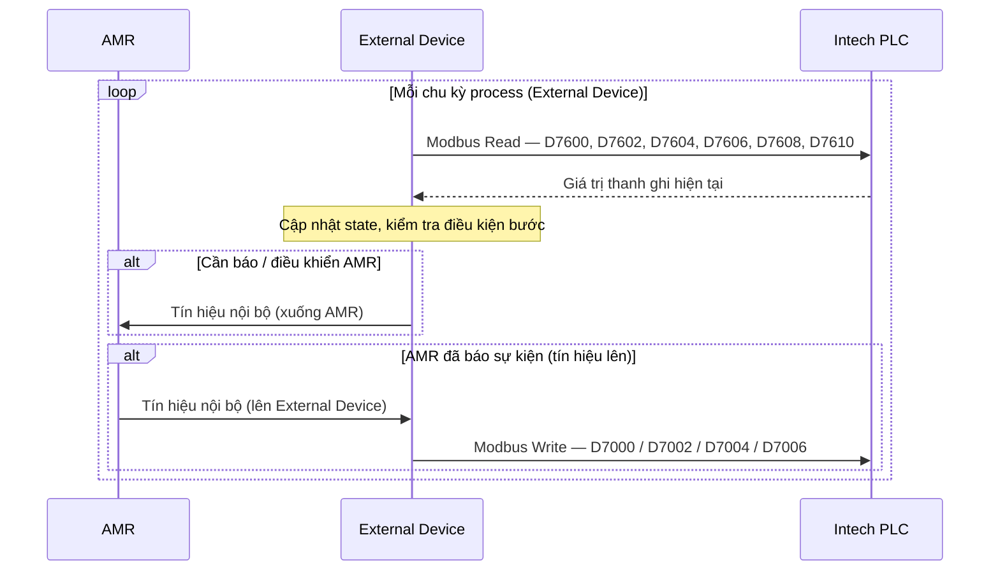
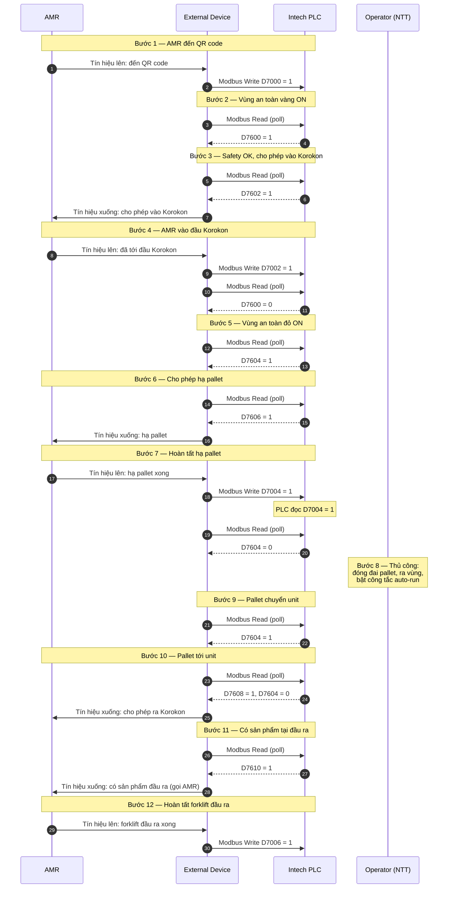
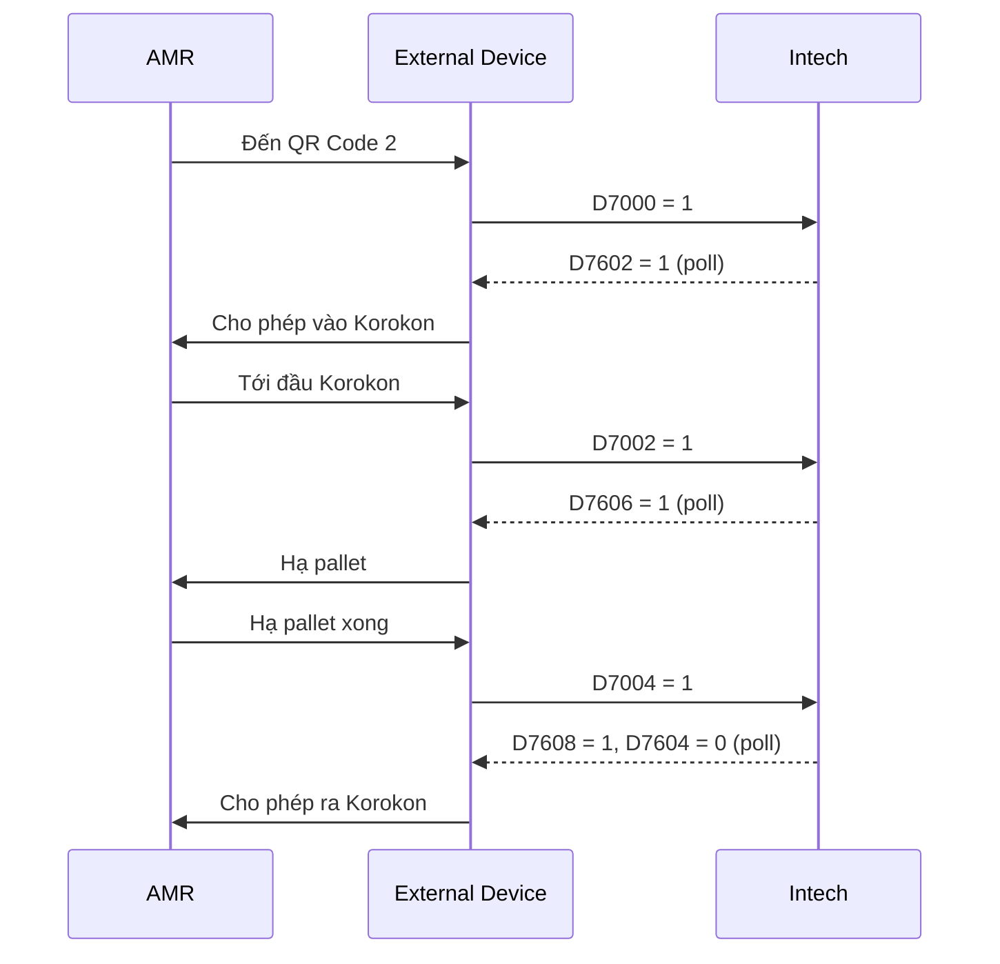
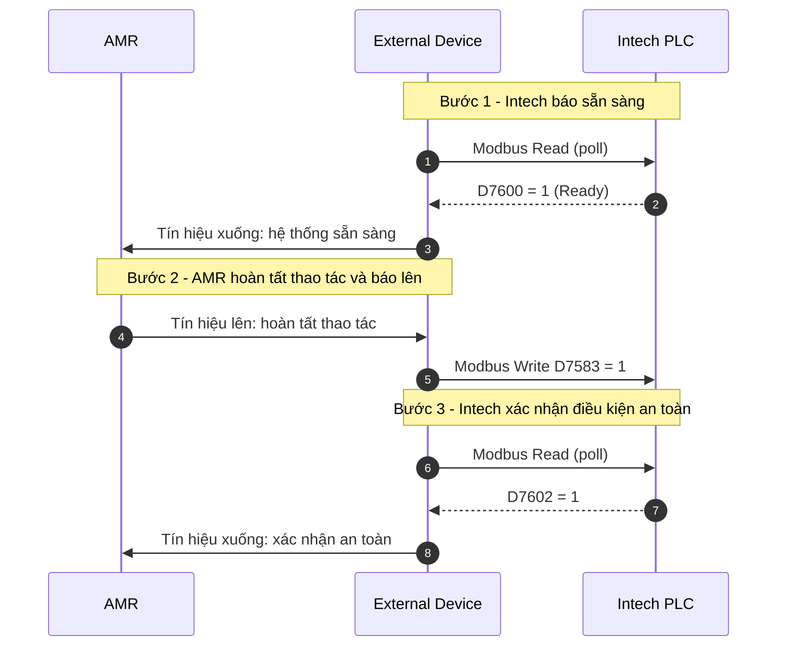

# Giao tiếp Modbus TCP/IP: AMR ↔ External Device ↔ Intech (Conveyor Korokon)

Tài liệu mô tả luồng giữa **AMR** (robot), **External Device** (node Modbus với PLC Intech) và **Intech PLC** (băng tải Korokon).

- **Modbus TCP/IP**: chỉ giữa **External Device ↔ Intech** (thanh ghi D7xxx / D76xx).
- **Tín hiệu nội bộ**: **AMR ↔ External Device** (không qua Modbus).

---

## Mô hình đọc / ghi (process loop — External Device)

**External Device** chạy **process lặp lại**. Trong mỗi chu kỳ:

| Hướng | Thanh ghi | External Device | AMR |
|--------|-----------|-----------------|-----|
| **Intech → External Device** | D7600, D7602, D7604, D7606, D7608, D7610 | **Đọc (poll)** mỗi chu kỳ | — |
| **External Device → Intech** | D7000, D7002, D7004, D7006 | **Ghi** khi nhận tín hiệu từ AMR | Gửi tín hiệu **lên** External Device trước khi ghi |
| **External Device → AMR** | (tín hiệu nội bộ) | Gửi tín hiệu **xuống** AMR sau khi đọc D76xx thỏa điều kiện | Nhận lệnh / cho phép |
| **AMR → External Device** | (tín hiệu nội bộ) | Nhận báo trạng thái từ AMR | Gửi tín hiệu **lên** khi đạt mốc (QR, Korokon, hạ pallet, …) |

Intech **không push** sang AMR; External Device **phát hiện** thay đổi nhờ **đọc lại D76xx** mỗi chu kỳ process.



---

## Sequence diagram — đầy đủ (12 bước)

Ba lifeline: **AMR** | **External Device** | **Intech PLC**.  
Mũi tên Modbus từ Intech về External Device = kết quả **đọc (poll)** trong một chu kỳ process.



---

## Sequence diagram — rút gọn (luồng chính)



---

## Bảng tín hiệu Modbus (External Device ↔ Intech)

### External Device → Intech — ghi sau tín hiệu từ AMR

| Địa chỉ | Mô tả | Giá trị | External Device | AMR |
|---------|--------|---------|-----------------|-----|
| **D7000** | AMR tại QR code #2 | 1 = có, 0 = không | Write (sau tín hiệu lên) | Báo đến QR → ExtDev ghi |
| **D7002** | AMR tại đầu Korokon | 1 = đang vào | Write (sau tín hiệu lên) | Báo tới đầu Korokon → ExtDev ghi |
| **D7004** | Hoàn tất hạ pallet | 1 = xong | Write (sau tín hiệu lên) | Báo hạ pallet xong → ExtDev ghi |
| **D7006** | Hoàn tất forklift đầu ra | 1 = xong | Write (sau tín hiệu lên) | Báo forklift xong → ExtDev ghi |

### Intech → External Device — đọc mỗi chu kỳ process

| Địa chỉ | Mô tả | Giá trị | External Device | AMR |
|---------|--------|---------|-----------------|-----|
| **D7600** | Vùng an toàn màu vàng | 1 = ON, 0 = OFF | Read (poll) | — |
| **D7602** | Hệ thống an toàn OK | 1 = không xâm nhập | Read (poll) → tín hiệu xuống: vào Korokon | Nhận lệnh vào |
| **D7604** | Vùng an toàn màu đỏ | 1 = ON, 0 = OFF | Read (poll) | — |
| **D7606** | Cho phép hạ pallet | 1 = cho phép | Read (poll) → tín hiệu xuống: hạ pallet | Thực hiện hạ pallet |
| **D7608** | Cho phép ra Korokon | 1 = cho phép | Read (poll) → tín hiệu xuống: ra Korokon | Nhận lệnh ra |
| **D7610** | Sản phẩm tại đầu ra | 1 = có sản phẩm | Read (poll) → tín hiệu xuống (nếu cần) | Nhận / thao tác đầu ra |

---

## Chi tiết 12 bước giao tiếp

| STT | Mô tả | Intech (PLC) | External Device | AMR |
|-----|--------|--------------|-----------------|-----|
| 1 | AMR đến QR code #2 | | Nhận tín hiệu lên → **Write** D7000 = 1 | Báo đến QR #2 |
| 2 | Vùng an toàn vàng ON | Set D7600 = 1 | **Read** D7600 = 1 | |
| 3 | Safety OK — cho phép vào Korokon | Set D7602 = 1 | **Read** D7602 = 1 → tín hiệu xuống | Nhận lệnh vào Korokon |
| 4 | AMR vào đầu Korokon | Set D7600 = 0 (sau D7002) | Nhận tín hiệu lên → **Write** D7002 = 1 | Báo tới đầu Korokon |
| 5 | Vùng an toàn đỏ ON | Set D7604 = 1 | **Read** D7604 = 1 | |
| 6 | Cho phép hạ pallet | Set D7606 = 1 | **Read** D7606 = 1 → tín hiệu xuống: hạ pallet | Hạ pallet |
| 7 | Hoàn tất hạ pallet | Đọc D7004 = 1 → set D7604 = 0 | Nhận tín hiệu lên → **Write** D7004 = 1; **Read** D7604 = 0 | Báo hạ pallet xong |
| 8 | Thủ công NTT | (không Modbus) | | |
| 9 | Pallet chuyển unit #2 | Set D7604 = 1 | **Read** D7604 = 1 | |
| 10 | Pallet unit #2 — AMR được ra | Set D7608 = 1, D7604 = 0 | **Read** D7608 = 1, D7604 = 0 → tín hiệu xuống: ra Korokon | Nhận lệnh ra |
| 11 | Sản phẩm đầu ra | Set D7610 = 1 | **Read** D7610 = 1 → tín hiệu xuống (nếu cần) | Thao tác đầu ra |
| 12 | Hoàn tất forklift đầu ra | | Nhận tín hiệu lên → **Write** D7006 = 1 | Báo forklift xong |

---

## Luồng an toàn (tóm tắt)

```
AMR đến QR → ExtDev ghi D7000
    → [Vàng ON, poll D7600] → Safety OK (poll D7602) → ExtDev → AMR: vào Korokon
    → AMR tới đầu Korokon → ExtDev ghi D7002 → [Vàng OFF, Đỏ ON]
    → poll D7606 → ExtDev → AMR: hạ pallet → AMR xong → ExtDev ghi D7004 → [Đỏ OFF]
    → (NTT thủ công) → [Đỏ ON, pallet unit #2]
    → poll D7608=1, D7604=0 → ExtDev → AMR: ra Korokon
    → poll D7610 → AMR forklift → ExtDev ghi D7006
```

---

*Tạo từ tài liệu giao tiếp Modbus TCP/IP Conveyor Intech với AMR; bổ sung lớp External Device và tín hiệu AMR ↔ External Device.*

---

## Sequence diagram — luồng ngắn theo hình mới

Luồng này được thêm theo bảng tín hiệu trong ảnh mới: Intech phát trạng thái sẵn sàng/an toàn, AMR xác nhận hoàn tất thao tác qua External Device.


