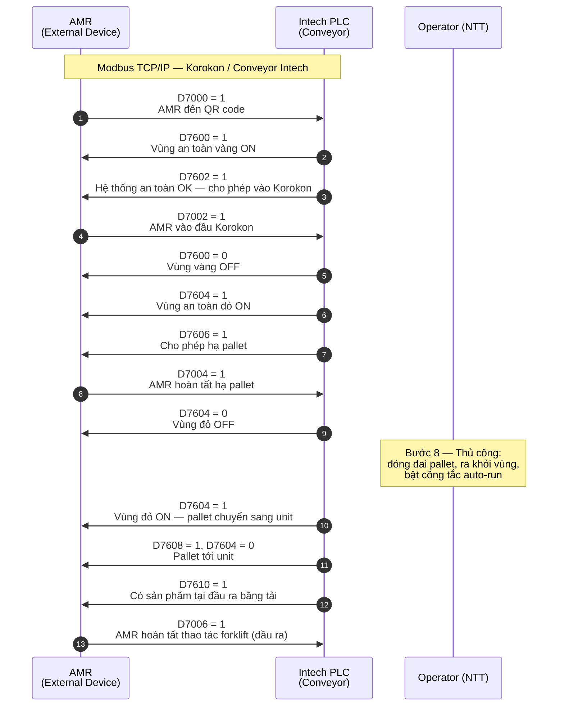
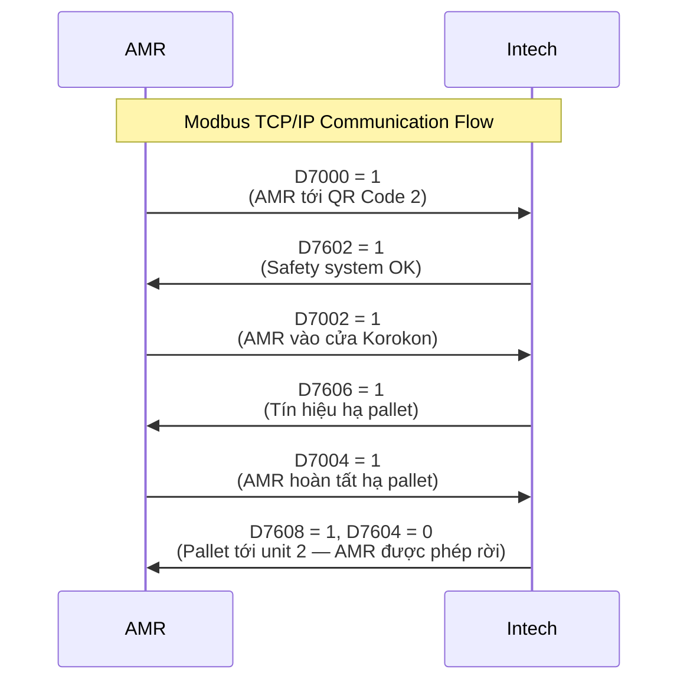

# Giao tiếp Modbus TCP/IP: AMR ↔ Intech (Conveyor Korokon)

Tài liệu mô tả luồng tín hiệu Modbus TCP/IP giữa **AMR** (External Device Node) và **Intech PLC** (băng tải Korokon), theo bảng địa chỉ D-register và sequence 12 bước.

---

## Mô hình đọc / ghi (process loop)

AMR chạy **process lặp lại** (chu kỳ cố định). Trong mỗi chu kỳ:

| Hướng | Thanh ghi | Cách xử lý trên AMR |
|--------|-----------|---------------------|
| **Intech → AMR** | D7600, D7602, D7604, D7606, D7608, D7610 | **Đọc (poll)** mỗi lần process chạy — cập nhật trạng thái nội bộ, rồi so với điều kiện bước hiện tại |
| **AMR → Intech** | D7000, D7002, D7004, D7006 | **Ghi** khi AMR đạt mốc sự kiện (đến QR, vào Korokon, hạ pallet xong, forklift xong) |

Intech **không push** tín hiệu sang AMR; PLC chỉ giữ giá trị trên thanh ghi. AMR **phát hiện thay đổi** nhờ đọc lại D76xx ở mọi chu kỳ process.

```mermaid
sequenceDiagram
    participant Loop as AMR process loop
    participant Intech as Intech PLC

    loop Mỗi chu kỳ process
        Loop->>Intech: Modbus Read — D7600, D7602, D7604, D7606, D7608, D7610
        Intech-->>Loop: Giá trị thanh ghi hiện tại
        Note over Loop: Cập nhật state, kiểm tra điều kiện bước
        alt Cần báo trạng thái sang PLC
            Loop->>Intech: Modbus Write — D7000 / D7002 / D7004 / D7006
        end
    end
```

Sequence diagram bên dưới mô tả **thứ tự logic** giữa hai bên; mũi tên **Intech → AMR** tương ứng lần AMR **đọc thấy** giá trị = 1 (hoặc 0) trong một chu kỳ process, không phải gói tin bất đồng bộ riêng lẻ.

---

## Sequence diagram — đầy đủ (12 bước)



---

## Sequence diagram — rút gọn (luồng chính)

Phiên bản này tương ứng sơ đồ luồng chính, bỏ qua chi tiết vùng vàng/đỏ, bước thủ công NTT và nhánh đầu ra.



---

## Bảng tín hiệu Modbus

### AMR → PLC (External Device Node → Intech) — ghi khi đổi trạng thái

| Địa chỉ | Mô tả | Giá trị | AMR |
|---------|--------|---------|-----|
| **D7000** | AMR tại QR code #2 | 1 = có, 0 = không | Write (sự kiện) |
| **D7002** | AMR tại đầu Korokon | 1 = đang vào | Write (sự kiện) |
| **D7004** | Hoàn tất hạ pallet | 1 = xong | Write (sự kiện) |
| **D7006** | Hoàn tất forklift tại đầu ra | 1 = xong | Write (sự kiện) |

### PLC → AMR (Intech → External Device Node) — đọc mỗi chu kỳ process

| Địa chỉ | Mô tả | Giá trị | AMR |
|---------|--------|---------|-----|
| **D7600** | Vùng an toàn màu vàng | 1 = ON, 0 = OFF | Read (poll) |
| **D7602** | Hệ thống an toàn | 1 = xác nhận không xâm nhập | Read (poll) |
| **D7604** | Vùng an toàn màu đỏ | 1 = ON, 0 = OFF | Read (poll) |
| **D7606** | Tín hiệu hạ pallet | 1 = cho phép AMR hạ pallet | Read (poll) |
| **D7608** | Tín hiệu cho phép AMR ra Korokon | 1 = cho phép | Read (poll) |
| **D7610** | Có sản phẩm tại đầu ra băng tải | 1 = có sản phẩm | Read (poll) |

---

## Chi tiết 12 bước giao tiếp

| STT | Mô tả | Intech (PLC) | AMR |
|-----|--------|--------------|-----|
| 1 | AMR đến QR code #2 | | **Write** D7000 = 1 |
| 2 | Vùng an toàn vàng ON | PLC set D7600 = 1 → AMR **read** thấy = 1 | |
| 3 | Hệ thống an toàn OK; cho phép vào Korokon | PLC set D7602 = 1 → AMR **read** thấy = 1 | |
| 4 | AMR vào đầu Korokon; đổi vùng an toàn | AMR **read** D7600 = 0 | **Write** D7002 = 1 |
| 5 | Vùng an toàn đỏ ON | AMR **read** D7604 = 1 | |
| 6 | Cho phép hạ pallet | AMR **read** D7606 = 1 | |
| 7 | AMR hoàn tất hạ pallet; tắt vùng đỏ | PLC **read** D7004 = 1, sau đó set D7604 = 0 → AMR **read** thấy | **Write** D7004 = 1 |
| 8 | Thủ công: NTT đóng đai, ra vùng, bật auto-run | (không Modbus) | |
| 9 | Vùng đỏ ON; pallet chuyển unit #2 | AMR **read** D7604 = 1 | |
| 10 | Pallet tới unit #2; AMR được ra | AMR **read** D7608 = 1, D7604 = 0 | |
| 11 | Có sản phẩm tại đầu ra; gọi AMR | AMR **read** D7610 = 1 | |
| 12 | AMR hoàn tất forklift đầu ra | | **Write** D7006 = 1 |

---

## Luồng an toàn (tóm tắt)

```
[Vàng ON] → Safety OK (D7602) → AMR vào → [Vàng OFF] → [Đỏ ON]
    → Hạ pallet (D7606) → AMR báo xong (D7004) → [Đỏ OFF]
    → (Thủ công NTT) → [Đỏ ON] → Pallet unit #2 → Ra Korokon (D7608)
    → Sản phẩm đầu ra (D7610) → AMR forklift xong (D7006)
```

---

*Tạo từ tài liệu giao tiếp Modbus TCP/IP Conveyor Intech với AMR.*
